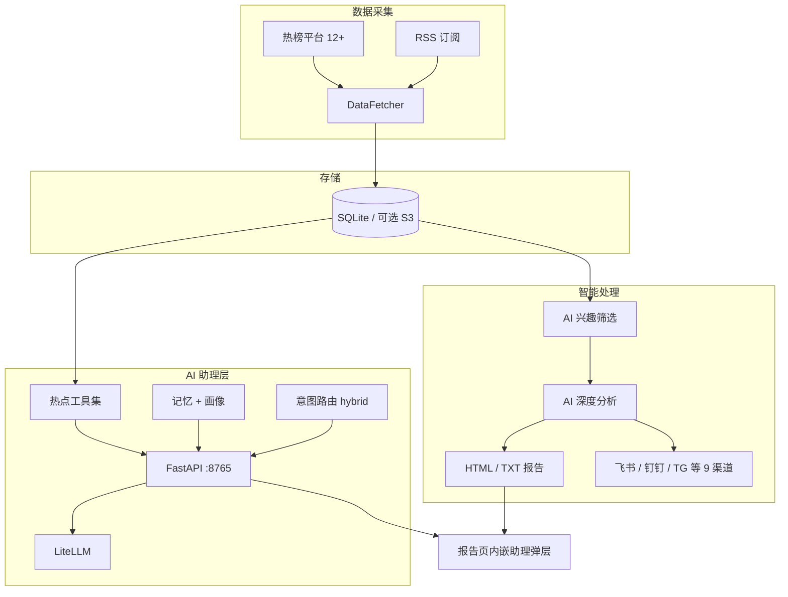

# TrendRadar

**多源热点情报采集 + AI 筛选分析 + 可对话情报助理**

面向「信息过载」场景：自动聚合国内热榜与 RSS 订阅，用 AI 按个人兴趣降噪、生成深度报告，并提供基于真实数据的 Tool-use Agent 对话能力。支持定时调度、多渠道推送、HTML 报告与 MCP 对外暴露。

---

## 解决什么问题

| 痛点 | 方案 |
|------|------|
| 多平台热搜分散，人工刷榜成本高 | 12+ 热榜 + 可扩展 RSS，统一采集入库 |
| 全量推送噪音大 | AI 兴趣标签 + 相关性打分 + 阈值过滤，关键词兜底 |
| 只看标题不够深 | 五维 AI 分析报告（舆情、争议、弱信号、RSS 洞察、策略建议） |
| 被动看报告不够灵活 | 本地 Web 助理：流式对话 + Function Calling 查库，带记忆与画像 |
| 需要接入外部 Agent | MCP Server（stdio / HTTP），8 组工具暴露情报数据 |

---

## 系统架构



**两条主线：**

1. **情报流水线**（`python -m trendradar`）：采集 → 存储 → AI 筛选/分析 → 报告与推送  
2. **对话助理**（`/assistant`）：在已有数据之上，用结构化工具 + 路由 + 记忆，回答「跟我有关的热点」类问题

---

## 核心能力一览

### 情报流水线

- **数据源**：今日头条、百度、微博、知乎、GitHub、B 站、财联社等热榜；Hacker News、Product Hunt 等 RSS
- **AI 筛选**：自然语言描述兴趣 → 自动提取标签；新闻打标 + 分数阈值；失败回退关键词匹配
- **报告模式**：增量 / 当前榜单 / 全天汇总；可独立配置采集、分析、推送时段
- **调度**：`always_on`、`morning_evening`、`office_hours`、`night_owl` 等预设 + 自定义 timeline
- **输出**：时间戳 HTML 快照、`latest/` 最新页、`index.html` 总览；可选 TXT

### AI 助理（本项目重点扩展）

| 模块 | 说明 |
|------|------|
| **FastAPI 服务** | `GET /assistant` 聊天页；`POST /api/assistant/ask` 同步；`POST /api/assistant/ask_stream` NDJSON 流式 |
| **工具调用** | 新闻分类/拉取、趋势对比、话题时间线、五维分析、GitHub 技术向趋势、周报组装等；统一 dispatcher |
| **意图路由** | `rule` / `llm` / **hybrid**（LLM 失败或低置信回退规则）→ 学习 / 投资 / 认知 三角色 prompt |
| **个人化过滤** | `insight_engine`：画像 topics + 盲区 → 公共热点压缩为「对你相关」列表 |
| **记忆系统** | Facts 落盘 + Profile 归纳；`recency × importance × relevance` 选 top facts 注入 |
| **回答自检** | 工具调用后对引用完整性做 reflection，降低编造风险 |
| **主动触达** | `PeriodicReviewAgent` 定时生成周报 Markdown，可选推送 |
| **报告联动** | HTML 报告页一键打开同源助理弹层 |

### 其他

- **MCP Server**：数据查询、趋势、搜索、配置、存储同步等 8 组工具  
- **评测**：`evals/` 路由准确度 + 工具调用闭环评测（含 hybrid ablation）  
- **运维**：`--doctor` 体检、`--test-notification` 渠道测试、`--show-schedule` 查看调度

---

## 技术栈

| 层级 | 技术 |
|------|------|
| 语言 | Python 3.10+ |
| Web / 助理 | FastAPI、Uvicorn、NDJSON 流式 |
| LLM | LiteLLM（DeepSeek / OpenAI / Gemini / Ollama 等） |
| 存储 | SQLite；可选 S3 兼容（R2 / OSS / COS / MinIO） |
| 协议 | MCP（FastMCP）、LSP 无关 |
| 配置 | YAML（`config/config.yaml`、`config/assistant_router.yaml`） |

---

## 快速开始（本地演示）

### 1. 安装依赖

```bash
cd TrendRadar
pip install -r requirements.txt
```

### 2. 配置 AI（助理与筛选共用）

编辑 `config/config.yaml` 中 `ai` 段，或设置环境变量：

```bash
# PowerShell
$env:AI_API_KEY = "sk-..."

# bash
export AI_API_KEY=sk-...
```

兴趣描述默认见 `config/ai_interests.txt`，可按需修改。

### 3. 运行主流程

```bash
python -m trendradar
```

执行采集、分析、生成报告；本地运行时会尝试在后台启动助理 Web（默认 `127.0.0.1:8765`），失败不影响主流程。

### 4. 仅启动 AI 助理

```bash
python -m trendradar --assistant-web
```

浏览器打开 **`http://127.0.0.1:8765/assistant`**（以终端输出为准）。

可选参数：`--assistant-web-host`、`--assistant-web-port`（默认 `8765`）、`--assistant-web-no-open`。

### 5. 健康检查

```bash
python -m trendradar --doctor
```

## 项目结构（精简）

```
TrendRadar/
├── config/                 # 主配置、调度 timeline、助理路由、兴趣文件
├── trendradar/
│   ├── __main__.py         # CLI 入口
│   ├── crawler/            # 热榜 / RSS 采集
│   ├── storage/            # SQLite / 远程存储
│   ├── ai/                 # LiteLLM 客户端、分析器
│   ├── report/             # HTML 报告（含助理弹层）
│   └── assistant/          # FastAPI、路由、记忆、工具、周报 Agent
├── evals/                  # 路由 & 工具调用评测
├── output/                 # 报告与运行产物
└── docs/
    ├── interview_narrative.md   # 面试叙事
    └── assistant-files.md       # 助理模块文件索引
```

---

## 评测

```bash
# 离线：仅规则路由（无需 API Key）
python evals/run_routing.py --only rule

# 完整：路由 ablation + 工具调用（需 AI_API_KEY）
python evals/run_all.py
```

结果输出至 `evals/results/`，含 `REPORT.md` 汇总。

---

## 许可证

本项目采用 [GPL-3.0](LICENSE) 许可证。
